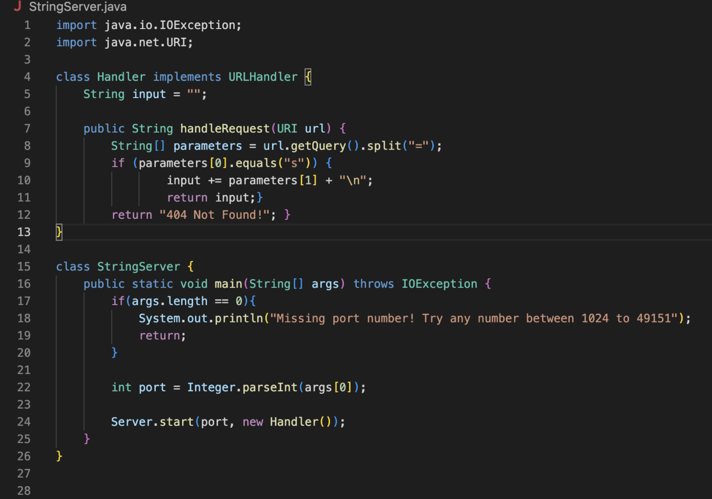
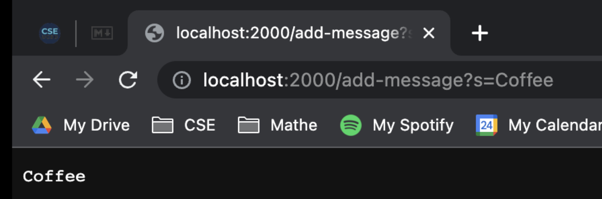

# CSE15L Report2
&nbsp;
&nbsp;
### Part 1

 
The first thing I did was git clone (pasted the url from github)  
Then once I had the files, I went to the handler class to read the code and help me write a method for StringSearch.java 
After that, I made sure to use the correct inputs for a url link such as "=", "s" and "\n" with all the correct inputs. :)  
 
 
 
 
 
 
 

### Remotely Connecting

 
The next step is to run the file on the terminal with while using the "/add-message?s=Coffee" and then running the link  

 
\ 
 
 
 
 
 
 
 
 
 
 
 
 
 
 
 
 

### Part2

 
Once you login to the Remote Server.  
You can use the commands "cd, ls, pwd, mkdir, and cp"
1. `cd`: allows the user to move through directories
2. `ls`: allows the user to view all the files in a directory
3. `pwd`: shows the user the pathway to the directory from the User
4. `mkdir`: allows the user to name and create a new directory 
5. `cp`: allows the user to copy a directory
 

